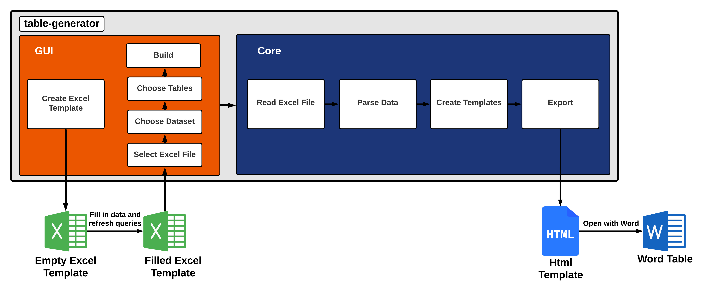
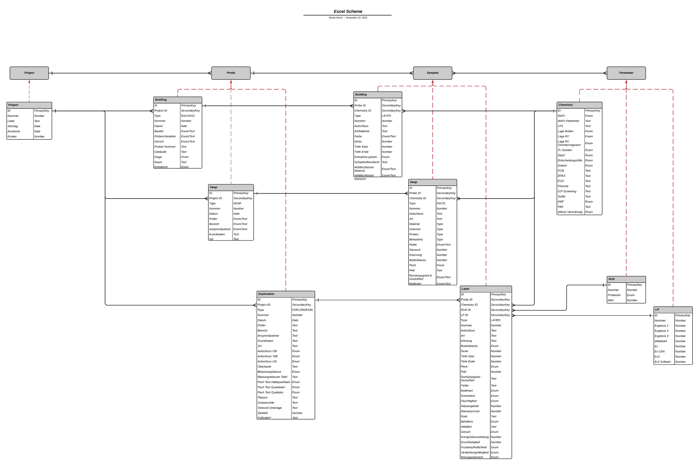

# sbt-table-generator
 
This is a pure java application, that automates the creation process of word tables. 
To use this application, download and run the .exe from the latest release.

- Generate a new excel template.
- Fill the Excel template with data.
- Update data with the "Refresh all" button under the Data tab in Excel.
- Select the created Excel template and a data source within the application.
- Choose a template.
- Generate. 
- Open the .html with word.

Seems like a lot of steps.

### What do you need?

#### To Compile
- Apache Ant & Ivy
- launch4j http://launch4j.sourceforge.net/  
install in your home under .launch4j or change the path in the build-exe.xml
- Java JDK 11 or higher

#### In General
- MS Office 365 or 2019

### Flow Chart

### Excel Template Explained

#### Queries with Power Query
#### Database Model

#### VBA

### Word Templates Explained
