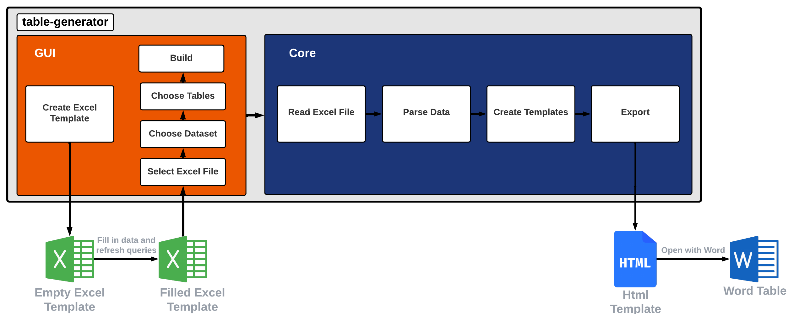
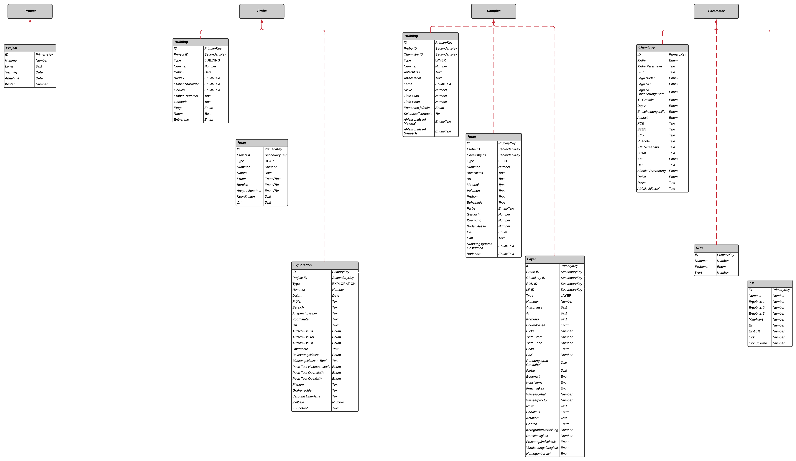

<div id="top"></div>

<!-- PROJECT SHIELDS -->
<!--
*** https://www.markdownguide.org/basic-syntax/#reference-style-links
-->
[![Contributors][contributors-shield]][contributors-url]
[![Forks][forks-shield]][forks-url]
[![Stargazers][stars-shield]][stars-url]
[![Issues][issues-shield]][issues-url]
[![MIT License][license-shield]][license-url]
[![LinkedIn][linkedin-shield]][linkedin-url]


<!-- PROJECT LOGO -->
<br />
<div align="center">
  <a href="https://github.com/mkuenzl/sbt-generator">
    
  </a>

<h3 align="center">sbt-table-generator</h3>

  <p align="center">
    An awesome README template to jumpstart your projects!
    <br />
    <a href="documentation/template-documentation.docx"><strong>Explore the docs »</strong></a>
    <br />
    <br />
    <a href="https://github.com/mkuenzl/sbt-generator/issues">Report Bug</a>
    ·
    <a href="https://github.com/mkuenzl/sbt-generator/issues">Request Feature</a>
  </p>
</div>


<!-- TABLE OF CONTENTS -->
<details>
  <summary>Table of Contents</summary>
  <ol>
    <li>
      <a href="#about-the-project">About The Project</a>
      <ul>
        <li><a href="#built-with">Built With</a></li>
      </ul>
    </li>
    <li>
      <a href="#getting-started">Getting Started</a>
      <ul>
        <li><a href="#prerequisites">Prerequisites</a></li>
        <li><a href="#installation">Installation</a></li>
      </ul>
    </li>
    <li><a href="#usage">Usage</a></li>
    <li><a href="#roadmap">Roadmap</a></li>
    <li><a href="#license">License</a></li>
    <li><a href="#contact">Contact</a></li>
    <li><a href="#acknowledgments">Acknowledgments</a></li>
  </ol>
</details>


<!-- ABOUT THE PROJECT -->
## About The Project

This is a pure java application, that automates the creation process of word tables.
To use this application, download and run the .exe from the latest release.

- Generate a new excel template.
- Fill the Excel template with data.
- Update data with the "Refresh all" button under the Data tab in Excel.
- Select the created Excel template and a data source within the application.
- Choose a template.
- Generate.
- Open the .html with word.

Seems like a lot of steps.

#### Flowchart  

The table generator is split up into two packages the GUI and the Core. With the JavaFx GUI the user is able to create and open an empty Excel Template. <br>
After the template is filled with all the information of probe sites and queries have been refreshed, the preferred dataset can be chosen which is split up into *all*,*erkundungsstelle*,*gebäude* and *haufwerk*. The tool retrieves the data only from the selected set. 
In the following all tables can be selected and build. The application reads the excel file, parses the information and creates HTML templates of the tables.
These .html files are created in the same working directory as the selected excel template. 
After the creation you are able to open the HTML tables with *MS Word* and import them into your project.




#### Data Structure

Following graphic shows the data structure used for the project. It mimics the Excel tables and shows also the naming of Java classes. 



<p align="right">(<a href="#top">back to top</a>)</p>


### Built With

This section lists of the frameworks/libraries used to bootstrap this project.

* [Java](https://www.java.com/de/)
* [Apache Ant](https://ant.apache.org/)
* [Apache Ivy](https://ant.apache.org/ivy/)
* [Launch4j](http://launch4j.sourceforge.net/)
* [MS Office 365](https://www.microsoft.com/de-de/microsoft-365/excel)

<p align="right">(<a href="#top">back to top</a>)</p>

<!-- GETTING STARTED -->
## Getting Started

If you want to use the developed program feel free to download the latest [release](https://github.com/mkuenzl/sbt-generator/releases/tag/v2.0.5).

To get a local copy up and running follow these simple example steps.

### Prerequisites

This is an example of how to list things you need to use the software and how to install them.
* Launch4j <br>
Please install Launch4j in your home directory under .launch4j or change the path in the build-exe.xml


* Apache Ant <br>
[(Manual)](https://ant.apache.org/manual/install.html)

### Installation

_Below is an example of how you can install and set up the application. This application doesn't rely on any external dependencies or services other than Apache Ant._

1. Clone the repo
   ```sh
   git clone https://github.com/mkuenzl/sbt-generator.git
   ```
2. Compile
   ```sh
   ant jar
   ```

<p align="right">(<a href="#top">back to top</a>)</p>


<!-- USAGE EXAMPLES -->
## Usage (in progress)

Use this space to show useful examples of how a project can be used. Additional screenshots, code examples and demos work well in this space. You may also link to more resources.

_For more examples, please refer to the [Documentation](documentation/template-documentation.docx)_

<p align="right">(<a href="#top">back to top</a>)</p>


<!-- ROADMAP -->
## Roadmap

- [x] Finished

See the [open issues](https://github.com/mkuenzl/sbt-generator/issues) for a full list of proposed features (and known issues).

<p align="right">(<a href="#top">back to top</a>)</p>


<!-- LICENSE -->
## License

Distributed under the AGPL-3.0 License. See `LICENSE.txt` for more information.

<p align="right">(<a href="#top">back to top</a>)</p>


<!-- CONTACT -->
## Contact

Moritz Künzl - mo.kuenzl@gmail.com

Project Link: [https://github.com/mkuenzl/sbt-generator](https://github.com/mkuenzl/sbt-generator)

<p align="right">(<a href="#top">back to top</a>)</p>


<!-- ACKNOWLEDGMENTS -->
## Acknowledgments

Use this space to list resources you find helpful and would like to give credit to. I've included a few of my favorites to kick things off!

* [Choose an Open Source License](https://choosealicense.com)
* [Best-README-Template](https://github.com/othneildrew/Best-README-Template)
* [Table icons created by Nhor Phai - Flaticon](https://www.flaticon.com/free-icons/table)

<p align="right">(<a href="#top">back to top</a>)</p>


<!-- MARKDOWN LINKS & IMAGES -->
<!-- https://www.markdownguide.org/basic-syntax/#reference-style-links -->
[contributors-shield]: https://img.shields.io/github/contributors/mkuenzl/sbt-generator.svg?style=for-the-badge
[contributors-url]: https://github.com/mkuenzl/sbt-generator/graphs/contributors
[forks-shield]: https://img.shields.io/github/forks/mkuenzl/sbt-generator.svg?style=for-the-badge
[forks-url]: https://github.com/mkuenzl/sbt-generator/network/members
[stars-shield]: https://img.shields.io/github/stars/mkuenzl/sbt-generator.svg?style=for-the-badge
[stars-url]: https://github.com/mkuenzl/sbt-generator/stargazers
[issues-shield]: https://img.shields.io/github/issues/mkuenzl/sbt-generator.svg?style=for-the-badge
[issues-url]: https://github.com/mkuenzl/sbt-generator/issues
[license-shield]: https://img.shields.io/github/license/mkuenzl/sbt-generator.svg?style=for-the-badge
[license-url]: https://github.com/mkuenzl/sbt-generator/blob/master/LICENSE.txt
[linkedin-shield]: https://img.shields.io/badge/-LinkedIn-black.svg?style=for-the-badge&logo=linkedin&colorB=555
[linkedin-url]: https://linkedin.com/in/moritz-kuenzl
[product-flowchart]: documentation/sbt-generator-flow.png


